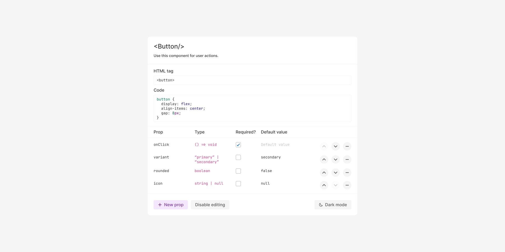

# Figma developer handoff widget

## Contents

- [How to use](#how-to-use)
- [Roadmap](#roadmap)
- [Contributing](#contributing)

## How to use

The easiest way to add this widget to your file is to use the Resources panel.
You can also use <kbd>⌘</kbd>+<kbd>P</kbd> to open the quick actions bar and search for "**Developer handoff**".
For an up-to-date guide, please refer to the [Figma documentation](https://help.figma.com/hc/en-us/articles/4410047809431-Use-widgets-in-files#Figma_design).

## Roadmap

- [ ] Add dark mode support for iframe
- [ ] Automatically detect user theme preferences

## Contributing and acknowledgements

PRs are welcome, as long as they would benefit most widget users: in other words, please don't add form fields that are specific to your use cases. If you need to extend this widget's functionality beyond what most users would consider beneficial, please fork this repo instead.

- [Create an issue](https://github.com/serenastorm/figma-developer-handoff/issues/new)
- [Open a PR](http://makeapullrequest.com)

❤️ Most of the code for the code editor and iframe are from [Dylan Freedman](https://github.com/freedmand)'s [code editor widget](https://github.com/freedmand/figma-code-editor-widget), which can be downloaded from the [Figma community](https://www.figma.com/community/widget/1125176659139239100).
